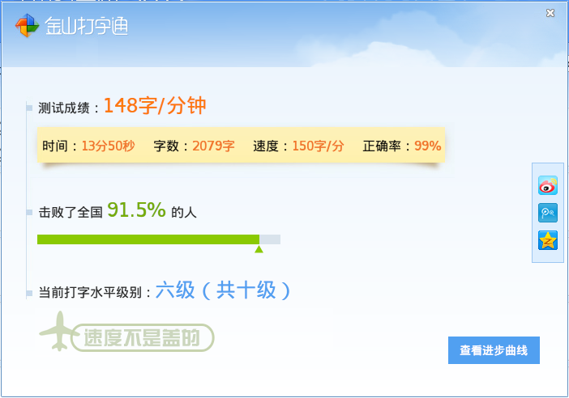

第二天的内容涉及到HTML常用元素的认识和使用，以及其他边沿常识。

## HTML入门

使用webstorm按照规定目录结构新建文件，如果遇到模板失效的情况，可以在Settings中查找选择File and Code Templates并进行相应更改。

### 什么是HTML？

引用维基百科的定义：

> 超文本标记语言（英语：HyperText Markup Language，简称：HTML）是一种用于创建网页的标准标记语言。

百度百科对“超文本”的解释为：

> “超文本”就是指页面内可以包含图片、链接，甚至音乐、程序等非文字元素。

关于“标记”，超文本标记语言是标准通用标记语言下的一个应用。“标记”大致是指由标签标记文本内容的格式文档。

### HTML基本元素

```
<html>  	定义网页框架
<head>  	定义网页头部
<title> 	定义网页标题，浏览器窗口显示
<body>  	定义网页内容
<h1~6>  	定义标题，字体变大，文本加粗
<br>    	换行标签，自闭合
<hr>    	分割线标签，自闭合
<!----> 	注释标签，标签内文本不显示
<p> 		定义段落，行级元素
<div>   	块级元素
<span>  	语义化标签，无实际效果
```

注意点：

- h1～h6系列标题一共只有6级
- 段内缩进可以设置p标签的text-indent属性

### HTML文本格式化元素

```
<b> 		定义粗体文本
<strong>	定义重要文本，效果类似b标签
<i>		定义斜体文本
<em> 		定义强调文本，效果类似i标签	
<u> 		定义下划线
<small> 	定义小号字体
<sup>   	定义上标文本
<sub>   	定义下标文本
<bdo dir="">    定义文本显示方向，dir属性值为ltr或者rtl
```

### HTML语义相关元素

```
<q> 		定义引用本文，文本自动加引号
<del>   	定义删除文本，文本加删除线
<ins>   	定义插入文本，文本加下划线
<pre>   	预格式化文本，按指定方式显示内容
```

### HTML图像相关元素

```
   	图像标签，定义图像区域
src 		指定图像资源位置，可以使用相对路径或绝对路径
alt 		图像说明文本，将在图像资源无法正常加载时显示
height  	指定图像的高
width   	指定图像的宽
usemap  	用于链接map映射，chrome不支持，火狐支持
<map>   	用于定义图片映射，包含一个或多个<area>
<area>  	用于定义图片映射的内部区域
    shape   	指定区域类型，rect举行，circle圆形，ploy多边形
    coords  	指定多个坐标值，指定区域位置
    href    	指定链接资源
```

### HTML超链接和锚点

```
<a> 	定义超链接，href指向资源或节点
```

参考阅读：[HTML 教程](http://w3school.com.cn/html/index.asp)

## 课堂测试

今天用金山打字通的单词练习测试打字速度，结果为：



## 课下问题

### 回顾MarkDown语法

```
*文本*    		斜体文本
**文本**  		粗体文本
# 文本    		一级标题
## 文本   		二级标题，最多六级
[链接](http://xxx.xxx)   外链接
*，+，-   		无序列表
1. 2. 3. 		有序列表
>   	 		文字引用
`hello`  		行内代码
```hello``` 		代码块
```

参考阅读：[Cmd Markdown 简明语法手册](https://www.zybuluo.com/mdeditor?url=https%3A%2F%2Fwww.zybuluo.com%2Fstatic%2Feditor%2Fmd-help.markdown)

### 字符集&字符编码

例如Unicodeh和UTF-8，Unicode相当于世界上所有字符的总字符集，UTF-8是Unicode的一个子集，包含了Unicode编码表中的部分内容，同时支持变长编码。而Unicode只支持定长编码。

参考阅读： [十分钟搞清字符集和字符编码](http://cenalulu.github.io/linux/character-encoding/)

### 常用字符集和字符编码

- ASCII 美国信息交换标准代码
- GB2312    信息交换用汉字编码字符集·基本集
- GB18030   信息技术 中文编码字符集
- Big5  使用繁体中文（正体中文）社区中最常用的电脑汉字字符集标准
- Unicode   统一码、万国码、单一码、标准万国码
- UCS   通用字符集
- UTF-8、UTF-16、UTF-32   Unicode的子集，集合大小不同

参考阅读： [字符集和字符编码（Charset & Encoding）](https://www.cnblogs.com/skynet/archive/2011/05/03/2035105.html)

## 其他

归档： [培训第二天](http://blog.smallyu.net/2017/12/10/%E5%9F%B9%E8%AE%AD%E7%AC%AC%E4%BA%8C%E5%A4%A9/)


## 补充 

### 2017.12.14

打字测速：


### 2017.12.15

打字测速：


### 2017.12.16

打字测速：

