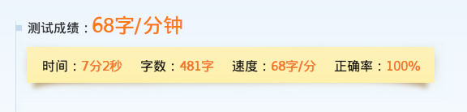

第三天的内容依旧是HTML标签部分，涉及到列表、表格、框架、音视频和表单等。

## HTML入门

### 列表相关元素

```
<ol>        用来定义有序列表，属性type用来更改默认标题，start用来指定开始位置
<ul>        用来定义无序列表，属性type更改列表项前的显示内容，square、circle
<li>        用来定义列表中的一个列表项
<dl>        用来定义自定义列表
<dt>        用来定义标题列表项
<dd>        用来定义普通列表项
```

#### 列表嵌套效果

用HTML标签实现类似这样的列表嵌套效果：

1. 山西
    - 运城
    - 太原
    - 临汾
2. 山东
    - 济南
    - 青岛
    - 烟台

语义上可以把无序列表ul写在有序列表的li标签里：

```html
<ol>
    <li>山西
        <ul>
            <li>运城</li>
            <li>太原</li>
            <li>大同</li>
        </ul>
    </li>

    <li>山东
        <ul>
            <li>济南</li>
            <li>青岛</li>
            <li>烟台</li>
        </ul>
    </li>
</ol>
```

但是如果想要改变有序列表项（内容项上一层级）的样式，如“山西”，“山东”，可能就需要其他方式来配合实现列表的嵌套，首先想到的也许是把内容写在span中。

### 表格相关元素

```
<table>             定义一个表格，border属性指定边框宽度
    cellpadding     设置单元格内容与单元格之间的距离
    cellspacing     设置单元格与单元格之间的距离
    <caption>       定义表格标题，内容居中
    <thead>         定义表格头部，语义化
    <tbody>         定义表格主体，语义化
    <tfoot>         定义表格脚部，语义化
    <tr>            定义表格中的一行
    <th>            定义表格表头，替换td，内容粗体居中
    <td>            定义表格中的一列
        colspan     设置单元格占据列数
        rowspan     设置单元格占据行数
```

### 框架相关元素

```
<frameset>      重构页面的body部分，和body不共存，已弃用
    rows        设置行高度，百分值
    cols        设置列宽度，百分值
    <frame>     引入一个页面，src指向资源
<iframe>        src引入页面，和body不冲突
```

### 音频和视频

```
<video>         定义视频控件
    src         配置视频资源路径
    controls    显示播放控件
    autoplay    页面加载后自动播放
    loop        循环播放
    width       控件宽度
    height      控件高度
```

### 表单相关元素

```
<form>          定义表单元素
<input>         定义输入框
    text        普通文本框
    password    密码文本框
    radio       单选按钮
    checkout    复选按钮
    file        文件选择框
    submit      提交按钮
    reset       重置按钮
    button      普通按钮
```

## 课下问题

### 什么是GET和POST？

课程中提到，form表单的method属性指定表单提交的方式，包括GET和POST。GET和POST最直观的区别就是GET提交的数据会显示在URL中，可以被直接读取。

GET提交的数据是跟随URL作为参数被传送到目标地址的，那POST提交的数据又放在什么地方呢？HTTP协议规定，POST提交的数据必须放在消息主体（entity-body）中。

HTTP又是什么？综合不同文档的定义，HTTP协议基于TCP/IP协议，是一种属于应用层的规范，具体实现了TCP/IP协议关于数据如何在万维网中通信的规范。

规范把HTTP请求分为三部分：状态行、请求头、消息主体。每一次POST请求都会向服务器发送这三部分内容，其中POST要提交的数据就在消息主体中。

使用课堂中做练习的demo6.html和address.html为例，POST方法提交表单数据的包内容如图所示：


可以看到表单数据清晰地显示在了Form Data中，还包括HTTP请求的一些其他参数，如Request URL指出了form表单提交的目标地址，因此所谓GET方法显示数据，POST方法不显示的说法并不准确，也因此，更为安全的HTTPS协议才被广泛应用。

参考阅读：[HTTP的POST提交的四种常见消息主体格式](http://blog.csdn.net/zhongzh86/article/details/51354920)

### GET和POST的区别？

表现上，GET和POST的区别也许是数据封装位置的不同，浏览器对两种请求方法处理方式的不同，以及对编码方式的支持不同，安全性不同等等，w3school对于GET和POST提供了比较标准的描述，参考阅读：[HTTP 方法：GET 对比 POST](http://www.w3school.com.cn/tags/html_ref_httpmethods.asp)

但是，GET和POST都基于TCP/IP的规范，本质都是TCP连接，所以也有观点认为它们是没有太大区别的，参考阅读：[99%的人都理解错了HTTP中GET与POST的区别](http://mp.weixin.qq.com/s?__biz=MzI3NzIzMzg3Mw==&mid=100000054&idx=1&sn=71f6c214f3833d9ca20b9f7dcd9d33e4#rd)

不过，即使是认为GET/POST区别不大的文章，也提到了它们有一个重大的区别，那就是GET只产生一个TCP数据包，而POST通常产生两个。

此外，还有一个叫幂等的概念需要注意，GET方法是幂等的，POST方法是非幂等的，参考阅读：[浅谈HTTP中Get与Post的区别](http://www.cnblogs.com/hyddd/archive/2009/03/31/1426026.html)

### GET和POST之外？

HTTP协议的请求方式当然不止GET/POST两种，还有PUT、DELETE等多种。目前使用最多的只有GET/POST，并且这两种方法就可以满足我们日常的使用。一般认为定义了多种请求方式是为了提供语义上的支持，比如RESTful就可能会把HTTP的请求方式考虑进去。

关于HTTP协议解释比较全面的文章，参考阅读：[HTTP协议详解（真的很经典）](http://www.cnblogs.com/li0803/archive/2008/11/03/1324746.html)

### 什么是HTTPS？

上面说HTTP协议的GET和POST方法都不是安全的，而HTTPS协议是安全的。引用百度百科的定义：

> HTTPS（全称：Hyper Text Transfer Protocol over Secure Socket Layer），是以安全为目标的HTTP通道，简单讲是HTTP的安全版。即HTTP下加入SSL层，HTTPS的安全基础是SSL，因此加密的详细内容就需要SSL。

那ssl又是什么？培训第一天的课程笔记中提到了ssh，从结果上认识ssh的话，ssh就是一种能保证数据在远程传输中安全性的协议。ssl不同于ssh，但功能上都是为了保证数据传输的安全。

### SSL和SSH的区别？

参考阅读：[SSL和SSH的区别](http://blog.csdn.net/simanstar/article/details/40592057)

## 其他

归档： [培训第三天](http://blog.smallyu.net/2017/12/17/%E5%9F%B9%E8%AE%AD%E7%AC%AC%E4%B8%89%E5%A4%A9/)

## 打字测速

### 2017.12.17


### 2017.12.18



### 2017.12.19


### 2017.12.20

