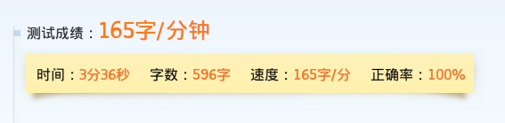

第四天结束了HTML标签部分，开始了CSS部分的内容，涉及到了CSS的常用选择器。

## HTML部分

### input相关属性

```
checked         默认选中，只针对单选框和复选框
disabled        禁用元素
maxlength       指定文本框输入最大字符数
placeholder     设置文本框内容的描述
readonly        只读，只针对文本框
size            设置元素宽度，文本框有效
```

注意很多属性file框不生效。

`<button>`标签作用类似按钮类型的`<input>`，也可指定submit、reset或button这样的属性值到type，效果与输入框相同。

### 下拉列表

```
<select>            定义下拉列表
    <option>        定义单个选项
        selected    默认选中
        value       值
    <optgroup>      定义列表项分组
        label       设置分组名称，一般必填
```

下拉列表项可以也可以使用disabled等属性。

### 文本域

```
<textarea>          定义文本域
    cols            文本域宽度，跨列数
    rows            文本域高度，跨行数
```

如果想要设置textarea前面的文本居上显示，或者textarea区域不可拖动改变大小，需要配合css样式来实现，标签本身并没有提供相应的属性。

## CSS入门

### 样式的引入

内嵌样式将样式直接写在标签的style属性中。

内部样式将样式写在head标签的style标签中。

外部样式在head标签中使用link标签链接，同时设置rel为stylesheet指明文档与被链接文档之间的关系。

样式的优先级遵循就近原则，内嵌样式始终是优先级最高的，内部样式和外部样式的优先级会由于标签的位置不同而不同，页面后面加载的会重载之前的。

### 常用选择器

- 属性选择器：

```
E[attr]                 对具有attr属性的元素生效
E[attr="value"]         对具有attr属性且值为value的元素生效
E[attr^="value"]        对具有attr属性且值以value开始的元素生效
E[attr$="value"]        对具有attr属性且值以value结尾的元素生效
E[attr*="value"]        对具有attr属性且值包含value的元素生效
```

- id选择器，使用符号"#"以`#value`的形式选择元素id为value的元素。

- 类选择器，使用符号"."以`.value`的形式选择元素class为value的元素。

- 子代选择器，使用符号">"以`f > c`的形式选择元素f的子元素c。

- 后代选择器，使用空格" "以`f c`的形式选择元素f的后代元素c。

- 兄弟选择器，使用符号"~"以`b1~b2`的形式选择与元素b1同级并位于其后的所有b2元素。

- 相邻兄弟选择器，使用符号"+"以`b1+b2`的形式选择与元素b1同级并位于其后的第一个b2元素。

任意种类的元素选择器都可以使用逗号隔开，以同时使用多种选择器，选中需要选中的多个元素。

- 伪元素选择器：

```
E:first-letter      对元素的第一个字符起作用
E:first-line        对元素的第一行内容起作用
E:before            在元素前面加入内容
    content         设置在元素前面要加入的内容
E:after             在元素后面加入内容
    content         设置在元素后面要加入的内容
```

- 伪类选择器：

```
E:first-child           选择作为父元素第一个元素的元素
E:last-child            选择作为父元素最后一个元素的元素
E:nth-child(n)          选择作为父元素第n个元素的元素
    nth-last-child(n)   选择作为父元素倒数第n个元素的元素
    nth-child(even)     设置偶数行
    nth-child(odd)      设置奇数行
```

- 锚伪类选择器：

```
E:link              超链接被访问前的状态
E:visited           超链接被访问后的状态
E:hover             设置鼠标划过的状态
E:active            设置正在被点击的状态
```

## 课下问题

### 浏览器缓存

浏览器的缓存机制，主要是HTTP协议定义的缓存机制。

Expires是Web服务器相应消息头的一个字段，告诉服务器在过期时间内可直接从缓存拉取数据。

Cache-control策略与Expires类似，但是指定项更多、更全面。

关于用户行为，刷新页面不可以重置缓存，而地址栏回车可以。

参考阅读：[浏览器缓存机制](https://www.cnblogs.com/skynet/archive/2012/11/28/2792503.html)

### 像素与分辨率的关系

很难的问题，目前没能解决。

## 其他

归档： [培训第四天](http://blog.smallyu.net/2017/12/24/培训第四天/)

## 打字测速

### 2017.12.24



### 2017.12.26


### 2017.12.26


