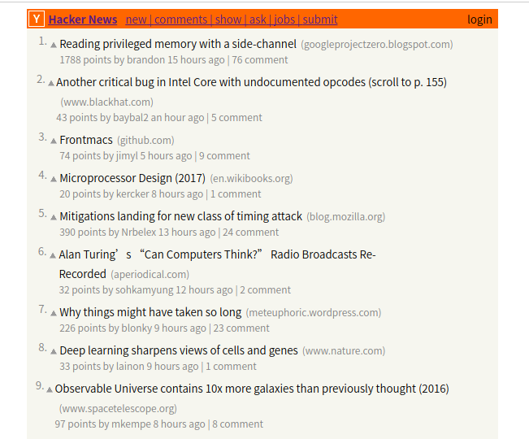

## 练习内容

根据教程，使用React和Webpack构建[Hacker News](https://news.ycombinator.com/)的前端页面。

教程地址：https://github.com/theJian/build-a-hn-front-page

## 版本兼容

原教程已指出，教程中使用的webpack版本并不兼容目前的最新版本，按照教程使用会报错。其实只需要简单修改，代码就可以正常运行。

在NewsHeader部分，配置webpack.config.js以引入样式表时，只需要将原代码：

```
{
  test: /\.css$/,
  loader: 'style!css'
}
```

改为：

```
{
  test: /\.css$/,
  loader: 'style-loader'
},
{
  test: /\.css$/,
  loader: 'css-loader'
}
```

还有要注意`loader: 'babel-loader'`，必须用`-loader`后缀，原教程没有 ^_^

