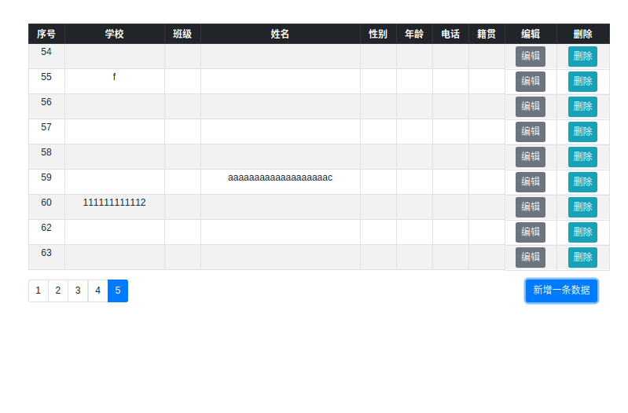
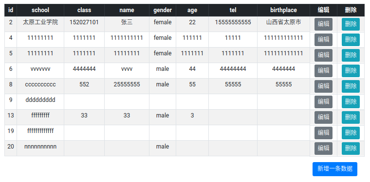

> MERN实现一个简单的学生信息表管理系统

## V0.1.2



### 一、解决的问题

- 编辑记录可以正常载入数据了

- 增加分页

- 增加简单的loading

### 二、未解决的问题

#### 1. 分页未完善

- 分页中间没有省略，如果页数过多会全部载入

- 没有页数跳转，暂时不需要

- 当一个页面的记录被全部删除，页面数目会刷新，全部数据不会。
    即一个页面的最后一条数据被删除，显示上没有刷新
    因为react的状态更新有延迟，解决这个问题得找其他思路

#### 2. 分页条数(limit参数)不可控

是写死的，如果由用户输入，可能需要存到session中


## V0.1.1

### 一、解决的问题

- 增加、编辑、删除，状态异步更新，不用再刷新页面了

- 改动组件结构，控制台不再报错

- 标题格式化为中文

### 二、未解决的问题

#### 1. 编辑页面不能载入数据了

react的input只有受控和非受控两种

使用受控表单父组件不能实时响应state的更改，表单上表现为无法输入

所以现在使用非受控表单。非受控表单没办法在视图渲染后更新值

#### 2. 组件、函数结构依旧混乱

改正这个，需要功底...

#### 3. 数据结构也有问题

表结构没变，使用时候的数据结构变了，有点乱

#### 4. 没有添加新的操作

和新的样式...


## Ｖ0.1.0



### 一、解决的问题

- 基本操作，对数据的增删改查

### 二、未解决的问题

#### 1. 新增点击确定~~后Table数据不会刷新~~

因为组件是相互独立的，Table和Add分离，首页数据只在页面加载时初始化一次

数据在Table中初始化，Add很难和Table通信

如果将state提升到Body，set时不会立即刷新，初始化数据都加载不出来

为了解决这个问题，现在每次新增都会**重载页面**，事实上是不合理的

#### 2. 删除后的重定向

和新增一样也是刷新了页面，应该用ajax的方法

#### 3. ~~如果数据库没有数据，页面会报错，新增按钮也显示不出来~~

数据是在一开始渲染的时候载入的，无法获取数据报错后，后面的元素也不会继续渲染

可以~~在首页加载时服务端检测，如果数据库为空，则添加默认数据。这样做不太好~~

也可以~~在获取数据时，客户端如果取不到，就跳转到初始化页面~~

或者~~更改元素结构~~

#### 4. 增删改查操作没有tips提示

还没写

#### 5. 删除应该用post

现在用get方便测试

#### 6. 没有数据验证

不太必要写

#### 7. 分页

这个(以后)必须有

#### 8. 模块共用

增加页面、编辑页面使用的medal应该共用

#### 9. 接口命名、返回数据不统一

可能会改，可能不会改

#### 10. 首页数据是升序还是降序

应该自定义，增加切换按钮

#### 11. 标题一行把字段名改为中文

在map时使用函数处理返回值，先不改了

#### 12. 没有搜索功能

首先确定搜索选项以什么样的形式，搜索哪些字段

然后搜索之后的结果也需要刷新table的状态，和新增删除是同一个问题

#### 13. 控制台有报错，还有打印 

下次再改吧...

### 三、表结构

```
StudentInfo {
    id: Integer,        // 存入序号
    school: String,     // 学校
    class: Integer,     // 班级
    name: String,       // 姓名
    gender: String,     // 性别
    age: Integer,       // 年龄
    tel: Integer,       // 手机号码
    birthplace: String  // 籍贯
}
```

### 四、路由

| 目录 | 方法 | 描述 |
| --- | :---: | --- |
/           | post | 默认查询所有数据 
/add        | post | 新增一条数据
/:id/edit   | post | 编辑一条数据
/:id/del    | get  | 删除一条数据
/getAll     | get  | 查询所有数据
/getLatest  | get  | 查询最新的一条数据
/:id/getOne | get  | 根据id查询(一条)数据

### 五、页面布局

暂时没有header，没有footer，先用一个表格做主体，实现基本功能
